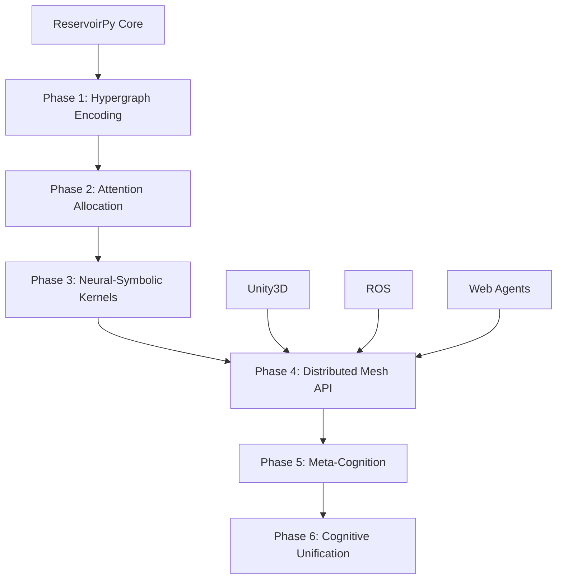

# Cognitive Grammar Network Integration Issues

This repository implements a GitHub Action to create comprehensive project management issues for integrating ReservoirPy repository functions as nodes in a distributed agentic cognitive grammar network.

## Quick Start

### Trigger the Workflow

1. **Navigate to Actions tab** in your GitHub repository
2. **Select "Cognitive Grammar Network Integration"** workflow  
3. **Click "Run workflow"**
4. **Choose phase option:**
   - `all` - Creates all 6 phases (recommended for initial setup)
   - `1-6` - Creates specific phase only

### What Gets Created

The workflow creates GitHub issues with:
- ✅ **Detailed objectives** and implementation roadmaps
- ✅ **Actionable sub-steps** with checkboxes for tracking
- ✅ **Acceptance criteria** for completion validation
- ✅ **Dependencies** and proper sequencing
- ✅ **Timeline estimates** for project planning
- ✅ **Labels** for organization (`cognitive-integration`, `phase-X`, etc.)

## Architecture Overview



## Phase Overview

| Phase | Focus | Integration | Duration |
|-------|-------|-------------|----------|
| 1 | **Cognitive Primitives** | ReservoirPy → Hypergraph | 4-6 weeks |
| 2 | **Attention Allocation** | ECAN + Reservoir Dynamics | 5-7 weeks |  
| 3 | **Neural-Symbolic** | ggml + ReservoirPy Bridge | 6-8 weeks |
| 4 | **Distributed Mesh** | APIs + Embodiment | 7-9 weeks |
| 5 | **Meta-Cognition** | Evolutionary Optimization | 8-10 weeks |
| 6 | **Unification** | Production Integration | 6-8 weeks |

**Total Estimated Duration**: 36-48 weeks for complete cognitive system

## Key Features

### ReservoirPy Integration
- **Deep Integration**: Each phase builds on ReservoirPy's reservoir computing capabilities
- **Node Architecture**: Extends existing ReservoirPy nodes for cognitive processing
- **Performance**: Maintains ReservoirPy's efficiency while adding cognitive features
- **Compatibility**: Ensures backward compatibility with existing ReservoirPy workflows

### Cognitive Computing Capabilities
- **Hypergraph Encoding**: Map reservoir states to symbolic representations
- **Attention Mechanisms**: Economic attention allocation across reservoir networks
- **Neural-Symbolic**: Bridge neural dynamics with symbolic reasoning
- **Embodiment**: Real-time interaction with Unity3D, ROS, and web platforms
- **Self-Optimization**: Evolutionary improvement of reservoir architectures

### Production Ready
- **Comprehensive Testing**: >95% test coverage with real-world validation
- **Documentation**: Living documentation with interactive examples
- **Scalability**: Distributed mesh architecture for concurrent agents
- **Monitoring**: Complete observability and performance tracking

## Technical Requirements

### Dependencies
- **ReservoirPy**: Core reservoir computing library
- **OpenCog AtomSpace**: Hypergraph representation (or equivalent)
- **ggml**: Custom neural-symbolic kernels
- **ECAN**: Economic attention allocation
- **Unity3D/ROS**: Embodiment platforms

### Environment
- **Python 3.11+**: Primary development language
- **GitHub Actions**: Automated workflow execution
- **PyGithub**: Issue creation and management
- **Docker**: Containerized deployment support

## Workflow Details

### GitHub Action Configuration
```yaml
name: "Cognitive Grammar Network Integration"
on:
  workflow_dispatch:
    inputs:
      create_phase:
        description: 'Phase to create (1-6, or "all")'
        required: true
        default: 'all'
        type: choice
```

### Issue Templates
Each phase includes:
- **Comprehensive objectives** aligned with ReservoirPy capabilities
- **Detailed sub-steps** with implementation guidance
- **Integration points** with existing ReservoirPy ecosystem
- **Verification protocols** for quality assurance
- **Timeline estimates** for project planning

### Labeling System
- `cognitive-integration`: All related issues
- `phase-X`: Specific phase identification  
- `enhancement`: Feature development
- `reservoir-computing`: ReservoirPy integration

## Expected Outcomes

### Immediate Value
- **Clear Roadmap**: 6-phase development plan with detailed milestones
- **Project Organization**: Comprehensive issue tracking and management
- **Team Coordination**: Clear dependencies and sequencing
- **Progress Tracking**: Actionable tasks with completion criteria

### Long-term Vision
- **Cognitive Computing Platform**: Production-ready distributed cognitive system
- **ReservoirPy Enhancement**: Advanced capabilities while maintaining core strengths
- **Research Foundation**: Platform for cognitive computing research and development
- **Industry Impact**: Reference implementation for neural-symbolic AI systems

## Getting Started

1. **Run the workflow** to create all phase issues
2. **Review Phase 1** for foundational requirements
3. **Set up development environment** with ReservoirPy and dependencies
4. **Begin implementation** following the detailed roadmaps
5. **Track progress** using GitHub issue checklists

## Support

- **Documentation**: Comprehensive guides in each phase issue
- **Examples**: ReservoirPy integration patterns and examples
- **Testing**: Automated validation and quality assurance
- **Community**: Collaboration through GitHub issues and discussions

---

*This cognitive grammar network represents a paradigm shift from traditional reservoir computing to distributed cognitive computing, using ReservoirPy as the foundational neural substrate for advanced AI systems.*